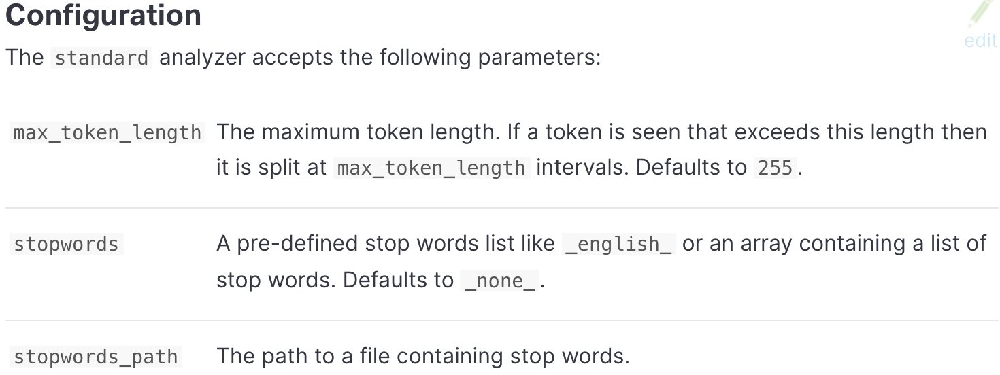
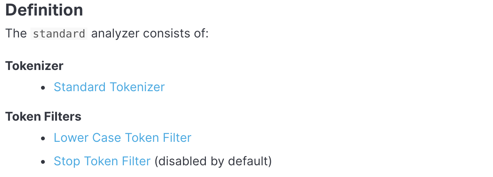

# Analysis

## 正排与倒排索引
- 正排索引：文档id到文档内容、单词的关联关系
- 倒排索引：单词到文档id的关联关系
### 倒排索引的组成
#### 单词词表（Term Dictionary）
  > 1、记录所有文档的单词  
  >2、记录单词到倒排列表的关联信息  
  >3、b+ tree 实现
#### 倒排列表 (Posting List)
  - 倒排索引项(Posting)
    >文档id：用于获取原始信息  
    >单词频率：单词在该文档出现的次数，用于后续相关性算分  
    >位置：记录单词在文档中分词的位置，用于词语搜索  
    >偏移：记录单词在文档的开始和结束位置，用于高亮显示  

`es存储的是json格式的文档，包含多个字段，每个字段都会有自己的倒排索引`

## 分词器（Analyzer）

### Character Filters
> 针对原始文本进行处理，可以对文本进行字符的添加、修改和删除。  
>每一个分词器可以没有或有多个Character Filters

### Tokenizer
> 将文本按照一定的规则切分成单词，负责记录单词的顺序和位置以及起始偏移量  
每个分词器有且仅有一个Tokenizer

### Token Filters
> 对Tokenizer处理的单词进行新增、修改和删除操作，不改变位置和偏移量

## Analyze API
> es提供一个测试分词的api，方便验证分词效果，endpoint是_analyze
### 直接指定analyzer进行测试

```
POST _analyze
{
  "analyzer": "whitespace",
  "text": "hello the world"
}
```
---
```
{
  "tokens": [
    {
      "token": "hello",
      "start_offset": 0,
      "end_offset": 5,
      "type": "word",
      "position": 0
    },
    {
      "token": "the",
      "start_offset": 6,
      "end_offset": 9,
      "type": "word",
      "position": 1
    },
    {
      "token": "world",
      "start_offset": 10,
      "end_offset": 15,
      "type": "word",
      "position": 2
    }
  ]
}
```

### [直接指定索引中的字段进行测试](https://www.elastic.co/guide/en/elasticsearch/reference/current/_testing_analyzers.html)

```
POST test_index/_analyze
{
  "field": "username",
  "text": "hello the world"
}
```

### 自定义分词器进行测试

```
POST _analyze
{
  "tokenizer": "standard",
  "filter": [ "lowercase" ],
  "text": "hello the world"
}
```

## [自带分词器](https://www.elastic.co/guide/en/elasticsearch/reference/current/analysis-analyzers.html)

- Standard Analyzer

 
 


## 自定义分词器
> 好像只能在索引中才能使用分词器的参数
### [Character Filters](https://www.elastic.co/guide/en/elasticsearch/reference/current/analysis-charfilters.html)

```
POST _analyze
{
  "tokenizer":      "keyword", 
  "char_filter":  [ "html_strip" ],
  "text": "<p>I&apos;m so <b>happy</b>!</p>"
}
```
---
```
{
  "tokens": [
    {
      "token": """

I'm so happy!

""",
      "start_offset": 0,
      "end_offset": 32,
      "type": "word",
      "position": 0
    }
  ]
}
```

### Tokenizers

### Token Filters