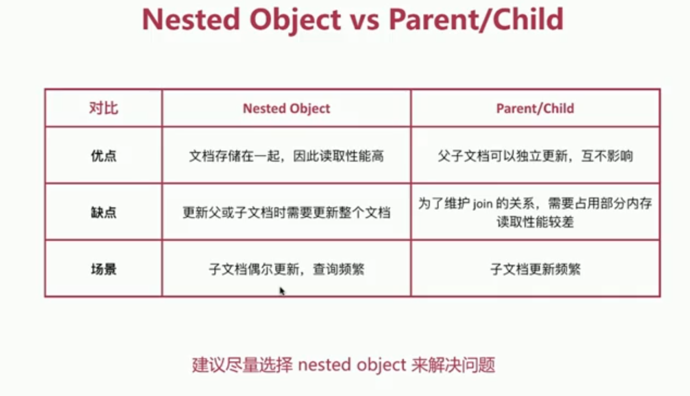

# 数据建模

## Mapping 字段相关配置
### enabled
- `true`|`false`
- 仅存储，不作搜索或聚合分析

### index
- `true`|`false`
- 是否构建倒排索引

### index_options
- `docs`|`freqs`|`positions`|`offsets`
- 存储倒排索引的哪些信息

### norms
- `true`|`false`
- 是否存储归一化相关参数，方便文档算分，如果字段仅用于过滤和聚合分析，可关闭

### doc_values
- `true`|`false`
- 用于排序和聚合分析

### feild_data
- `false`|`true`
- 是否为`text`类型启用feilddata，实现排序和聚合分析

### store
- `false`|`true`
- 是否存储该字段值，字段默认存储在_source中

## Mapping字段属性设定流程
- 是何种类型
- 是否需要检索
- 是否需要排序和聚合分析
- 是否需要另行存储

## 案例
> 博客文章 blog_index  
> - 标题 title
> - 发布日期 publish_date
> - 作者 author
> - 摘要 abstract
> - 内容 content
> - 网络地址url

### 初步设计1
>所有字段内容存储在_source中，当字段内容较大时，会影响搜索性能
```
PUT blog_index
{
    "mappings":{
        "doc":{
            "properties":{
                "title":{
                    "type":"text",
                    "fields":{
                        "keyword":{
                            "type":"keyword",
                            "ignore_above":100
                        }
                    }
                },
                "publish_date":{
                    "type":"date"
                },
                "author":{
                    "type":"keyword",
                    "ignore_above":100
                },
                "abstract":{
                    "type":"text"
                },
                "url":{
                    "enabled":false
                },
                "content":{
                    "type":"text"
                }
            }
        }
    }
}
```
### 修改设计2
> 利用store属性解决内容较大的问题
```
PUT blog_index
{
    "mappings":{
        "doc":{
            "_source":{
                "enabled":false
            },
            "properties":{
                "title":{
                    "type":"text",
                    "fields":{
                        "keyword":{
                            "type":"keyword",
                            "ignore_above":100
                        }
                    },
                    "store":true
                },
                "publish_date":{
                    "type":"date",
                    "store":true
                },
                "author":{
                    "type":"keyword",
                    "ignore_above":100,
                    "store":true
                },
                "abstract":{
                    "type":"text",
                    "store":true
                },
                "url":{
                    "type":"keyword",
                    "doc_values":false,
                    "norms":false,
                    "ignore_above":100,
                    "store":true
                },
                "content":{
                    "type":"text",
                    "store":true
                }
            }
        }
    }
}
```
---
> 搜索及高亮
```
GET blog_index/_search
{
    "stored_fields":["title"],
    "query":{
        "match":{
            "content":"blog"
        }
    },
    "highlight":{
        "fields":{"content":{}}
    }
}
```

## 关联关系
> es不擅长处理关系型数据库中的关联关系，可通过以下两种方式变相解决

### Nested Object
> 和`Object`字段类型不同，允许对象数组可以相互独立进行查询和索引
#### 对象数组默认视为`object`类型字段
```
PUT my_index/_doc/1
{
  "group" : "fans",
  "user" : [ 
    {
      "first" : "John",
      "last" :  "Smith"
    },
    {
      "first" : "Alice",
      "last" :  "White"
    }
  ]
}
```
---
> `object`字段类型在内部会转化成类似下列的文档，会失去对象的关联性
```
{
  "group" :        "fans",
  "user.first" : [ "alice", "john" ],
  "user.last" :  [ "smith", "white" ]
}
```
> 下列查询我们期望的结果是不会返回数据，但是有匹配的文档返回
```
GET my_index/_search
{
  "query": {
    "bool": {
      "must": [
        { "match": { "user.first": "Alice" }},
        { "match": { "user.last":  "Smith" }}
      ]
    }
  }
}
```
#### 将`nested`字段用于对象数组
> `nested`对象将数组中的每个对象作为单独的隐藏文档编制索引，这意味着可以使用`nested`查询独立查询每个`nested`对象
```
PUT my_index
{
  "mappings": {
    "properties": {
      "user": {
        "type": "nested" 
      }
    }
  }
}
```
```
PUT my_index/_doc/1
{
  "group" : "fans",
  "user" : [
    {
      "first" : "John",
      "last" :  "Smith"
    },
    {
      "first" : "Alice",
      "last" :  "White"
    }
  ]
}
```
---
> 可高亮显示匹配文档中的nested文档
```
GET my_index/_search
{
  "query": {
    "nested": {
      "path": "user",
      "query": {
        "bool": {
          "must": [
            { "match": { "user.first": "Alice" }},
            { "match": { "user.last":  "White" }} 
          ]
        }
      },
      "inner_hits": { 
        "highlight": {
          "fields": {
            "user.first": {}
          }
        }
      }
    }
  }
}
```
### Parent/Child
>使用`join`数据类型实现，可在相同索引的文档中创建父/子关系，下列指明`question`是`answer`的父类
```
PUT my_index
{
  "mappings": {
    "properties": {
      "my_join_field": { 
        "type": "join",
        "relations": {
          "question": "answer" 
        }
      }
    }
  }
}
```
> 创建父文档，不必在对象中指明关系名称，可直接指明
```
PUT my_index/_doc/1?refresh
{
  "text": "This is a question",
  "my_join_field": {
    "name": "question" 
  }
}

PUT my_index/_doc/2?refresh
{
  "text": "This is another question",
  "my_join_field": "question"
}
```
> 创建子文档，指明`routing`值,确保父子文档在同一分片上，一般使用父文档id
```
PUT my_index/_doc/3?routing=1&refresh 
{
  "text": "This is an answer",
  "my_join_field": {
    "name": "answer", 
    "parent": "1" 
  }
}

PUT my_index/_doc/4?routing=1&refresh
{
  "text": "This is another answer",
  "my_join_field": {
    "name": "answer",
    "parent": "1"
  }
}
```

#### 常见的query语法
- parent_id
> 返回某父文档的子文档，`type`指明子文档类型
```
GET /my-index/_search
{
  "query": {
      "parent_id": {
          "type": "my-child",
          "id": "1"
      }
  }
}
```
- has_child
> 返回符合子文档查询条件的父文档
```
GET /_search
{
    "query": {
        "has_child" : {
            "type" : "child",
            "query" : {
                "match_all" : {}
            },
            "max_children": 10,
            "min_children": 2,
            "score_mode" : "min"
        }
    }
}
```
- has_parent
> 返回符合父文档查询条件的子文档
```
GET /my-index/_search
{
    "query": {
        "has_parent" : {
            "parent_type" : "parent",
            "query" : {
                "term" : {
                    "tag" : {
                        "value" : "Elasticsearch"
                    }
                }
            }
        }
    }
}
```

## Reindex
> 重建所有数据的过程

### 执行场景
- mapping设置变更，比如字段类型变更，分词器字典更新等
- index设置变更，比如分片数更改等
- 数据迁移
### API