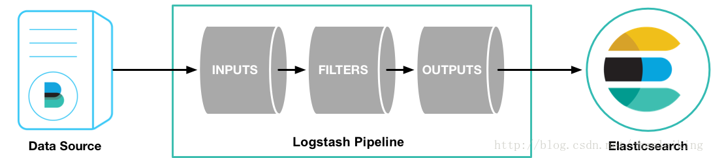
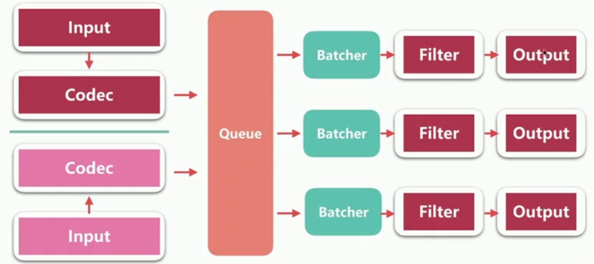

# Logstash

## Logstash架构
> The Logstash event processing pipeline has three stages: inputs → filters → outputs. `Inputs` generate events, `filters` modify them, and `outputs` ship them elsewhere. Inputs and outputs support `codecs` that enable you to encode or decode the data as it enters or exits the pipeline without having to use a separate filter.


> 每一个Batcher对应一个工作线程


### Queue
#### 分类
- In Memory
> 无法处理进程Crash、机器宕机等情况，会导致数据丢失
- [Persistent Queue](https://www.elastic.co/guide/en/logstash/current/persistent-queues.html) In Disk
> 可处理进程Crash等情况，保证数据不丢失  
保证数据至少消费一次  
充当缓冲区，可以替代kafka等消息队列的作用
---
> 相关配置：
> - queue.type：persisted（默认是memory）
> - queue.max_bytes：4gb（队列存储的最大数据量）

### 线程
- Input Thread

- Pipeline Worker Thread
> 相关配置：
> - pipeline.workers|- w（pipeline线程数，即filter_output处理线程数，默认数cpu核数）
> - pipeline.batch.size|-b（Batcher一次批量获取待处理文档数）
> - pipeline.batch.delay|-u（Batcher等待的时长，单位为ms）

## Logstash配置
### logstash设置相关配置文件
- logstash.yml
- jvm.options
### pipeline配置文件
#### 字段类型
- Boolean  
isFaile => true
- Number  
port => 33  
- String  
name => "Hello World"
- Array  
- Hash

#### 字段值引用
- 直接引用，使用[]
- 在字符串中引用字段值，使用%{}

## [Input Plugins](https://www.elastic.co/guide/en/logstash/current/input-plugins.html)
### sdtin

- add_field
> Value Type:hash  
Default Value:{}  
给Event添加新的字段
- codec
> Value Type:[codec](https://www.elastic.co/guide/en/logstash/7.5/configuration-file-structure.html#codec)(编解码器)  
Default Value:"line"
- tags
> Value Type:array  
> 给Event添加标签用于后续处理
- type
> Value Type:String  

`input-stdin.conf`
```
input {
    stdin {
        codec => "plain"
        tags => ["test"]
        type => "std"
        add_field => {"key" => "value"}
    }
}

output {
    stdout {
        codec => "rubydebug"
    }
}
```
---

`echo "Hello World"|bin/logstash -f config/input-stdin.conf`
```
{
    "message" => "Hello World",
    "host" => "liufukangdeMacBook-Pro.local",
    "@timestamp" => 2020-02-09T14:26:16.711Z,
    "tags" => [
        [0] "test"
    ],
    "type" => "std",
    "key" => "value",
    "@version" => "1"
}

```
### file
- path
>Value Type:array  
指明读取文件路径
- exclude
> Value Type:array  
排除不想监听的文件规则
- sincedb_path
> Vaule Type:string  
sincedb数据库文件的路径（保持跟踪受监视日志文件的当前位置）
- start_position
> beginning 或 end（default） 
是否从头读取文件
- start_interval
> 定期检查文件是否更新，单位秒，默认为1秒
- discover_interval
> 定时检查是否有新文件待读取，单位秒，默认为15秒

`input-file.conf`(这样在测试的时候会后弊端，beginning只在第一次有效) 
可以设置sincedb_path指向 /dev/null
```
input {
    file {
        path => "/Users/liufukang/data/logstash/*"
        type => "file"
        add_field => {"key" => "value"}
        start_position => "beginning"
    }
}

output {
    stdout {
        codec => "rubydebug"
    }
}
```
---
`bin/logstash -f config/input-file.conf`
```
{
      "@version" => "1",
       "message" => "hello world",
          "path" => "/Users/liufukang/data/logstash/err.log",
          "type" => "file",
    "@timestamp" => 2020-02-15T08:08:48.632Z,
          "host" => "liufukangdeMacBook-Pro.local",
           "key" => "world"
}
```

### kafka

## [Codec Plugin](https://www.elastic.co/guide/en/logstash/current/codec-plugins.html)
> 编解码器本质上是流过滤器，可以作为输入或输出的一部分进行操作。

### 简单案例
`./bin/logstash -e "input{stdin{codec => plain}} output{stdout{codec => rubydebug}}"`  

hello,world
```
{
       "message" => "hello,world",
      "@version" => "1",
    "@timestamp" => 2020-02-17T07:29:04.674Z,
          "host" => "liufukangdeMacBook-Pro.local"
}
```
---
`echo "hello\nworld"|./bin/logstash -e "input{stdin{codec => line}} output{stdout{codec => json}}"`
```
{"message":"hello","host":"liufukangdeMacBook-Pro.local","@timestamp":"2020-02-17T07:44:54.021Z","@version":"1"}{"message":"world","host":"liufukangdeMacBook-Pro.local","@timestamp":"2020-02-17T07:44:54.036Z","@version":"1"}
```
### multiline
>当一个Event的message由多行组成时,需要用到该codec
- pattern
> 设置匹配行的正则表达式，必须设置
- what
> previous | next  
如果匹配成功，匹配行归属上一个事件还是下一个事件
- negate
> true | false  
是否对pattern的结果取反
```
以空格开头的行都属于上一行
input {
    stdin {
        codec => multiline {
            pattern => "^\s"
            what => "previous"
        }
    }
}
```

## [Filter Plugin](https://www.elastic.co/guide/en/logstash/current/filter-plugins.html)
> 对Logstash Event进行丰富处理，解析数据、删除字段、类型转换等等
### data
> 解析字段中的日期字符串为日期类型，替换@timestamp字段或其他指定的字段
- match
>Value Type:array  
指定日期匹配格式，可以一次指定多种日期格式  
`[ field,formats... ]`
```
filter {
      date {
        match => [ "logdate", "MMM dd yyyy HH:mm:ss" ]
      }
    }
```
- target
> Value Type:string  
用于指定赋值的字段名，默认是@timestamp
- timezone
> Value Type:string  
用于指定时区

### grok
- 语法
> `%{SYNTAX:SEMANTIC}`  
`SYNTAX`:grok pattern的名称  
`SEMANTIC`:赋值字段名称
- [grok pattern](https://github.com/logstash-plugins/logstash-patterns-core/tree/master/patterns)
- 自定义匹配规则
> `(?<field_name>the pattern here)`  
> (?<queue_id>[0-9A-F]{10,11})
```
input {
    http{ port => 7474 }
}
filter{
    grok{
        match=>{ "message" => "(?<id_card>[0-9A-F]{5,8})" }
    }
    mutate{
        remove_field => [ "headers" ]
    }
}
output {
    stdout {
        codec => "rubydebug"
    }
}
```
```
{
          "host" => "127.0.0.1",
       "message" => "12345",
       "id_card" => "12345",
      "@version" => "1",
    "@timestamp" => 2020-02-17T15:30:06.968Z
}
```
---
>`pattern_definitions`   
以键值对的方式定义pattern的名称和内容
```
input {
    http{port=>7474}
}
filter{
    grok{
        match => { "message" => "%{SERVICE:service}" }
        pattern_definitions => {"SERVICE" => "[a-z0-9]{10,11}"}
    }
    mutate{
        remove_field => [ "headers" ]
    }
}
output {
    stdout {
        codec => "rubydebug"
    }
}
```
```
{
          "host" => "127.0.0.1",
       "message" => "abc12345678",
       "service" => "abc12345678",
      "@version" => "1",
    "@timestamp" => 2020-02-18T13:52:54.325Z
}
```

- 使用案例
```
input {
    file {
    path => "/var/log/http.log"
    }
}
filter {
    grok {
    match => { "message" => "%{IP:client} %{WORD:method} %{URIPATHPARAM:request} %{NUMBER:bytes} %{NUMBER:duration}" }
    }
}
```
```
55.3.244.1 GET /index.html 15824 0.043
```
```
client: 55.3.244.1
method: GET
request: /index.html
bytes: 15824
duration: 0.043
```

### dissert
> 

### mutate
> 重命名，删除，替换和修改事件中的字段

## Output Plugin

### stdout

### file

### elasticsearch

## 项目实战

### Apache日志导入elasticsearch
`apache-log.conf`
```
input{
    #三种数据输入方式

    #http{
    #    port => 7474
    #}

    stdin{}
   # file{
   #     path => "/Users/rockybean/Downloads/es/6.1/logstash-6.1.1/demo_data/apache_logs/apache_logs"
   #     start_position => "beginning"
   # }
}

filter{
    #如果是测试，则添加@metadata子字段供后续判断
    mutate{add_field => {"[@metadata][debug]"=>true}}

    #grok filter解析apache log
    grok{
        match => {
            "message" => '%{IPORHOST:clientip} %{USER:ident} %{USER:auth} \[%{HTTPDATE:[@metadata][timestamp]}\] "(?:%{WORD:verb} %{NOTSPACE:request}(?: HTTP/%{NUMBER:httpversion})?|%{DATA:rawrequest})" %{NUMBER:response} (?:%{NUMBER:bytes}|-) %{QS:referrer} %{QS:agent}'
        }
    }

    #用ruby代码给字段赋值
    ruby{
        code => "event.set('@read_timestamp',event.get('@timestamp'))"
    }

    # 20/May/2015:21:05:56 +0000
    date{
        match => ["[@metadata][timestamp]","dd/MMM/yyyy:HH:mm:ss Z"]
    }

    mutate{
        convert => {"bytes" => "integer"}
    }

    geoip{
        source => "clientip"
        fields => ["location","country_name","city_name","region_name"]
    }

    useragent{
        source => "agent"
        target => "useragent"
    }

    mutate{remove_field=>["headers"]}

    mutate{
        add_field=>{
            "[@metadata][index]" => "apache_logs_%{+YYYY.MM}"
        }
    }

    if "_grokparsefailure" in [tags] {
        mutate{
            replace=>{
                "[@metadata][index]" => "apache_logs_failure_%{+YYYY.MM}"
            }
        }
    }else{
        mutate{remove_field=>["message"]}

    }

}

output{
    if [@metadata][debug]{
        stdout{codec=>rubydebug{metadata=>true}}
    }else{
        stdout{codec=>dots}

        elasticsearch{
            index => "%{[@metadata][index]}"
            document_type => "doc"
        }
    }
}
```
`46.105.14.53 - - [20/May/2015:21:05:15 +0000] "GET /blog/tags/puppet?flav=rss20 HTTP/1.1" 200 14872 "-" "UniversalFeedParser/4.2-pre-314-svn +http://feedparser.org/"`
```
{
            "request" => "/blog/tags/puppet?flav=rss20",
              "agent" => "\"UniversalFeedParser/4.2-pre-314-svn +http://feedparser.org/\"",
              "geoip" => {
        "country_name" => "France",
            "location" => {
            "lon" => 2.3387000000000002,
            "lat" => 48.8582
        }
    },
               "auth" => "-",
              "ident" => "-",
          "@metadata" => {
            "index" => "apache_logs_2015.05",
            "debug" => "true",
        "timestamp" => "20/May/2015:21:05:15 +0000"
    },
               "verb" => "GET",
          "useragent" => {
             "os" => "Other",
          "build" => "",
           "name" => "Other",
        "os_name" => "Other",
         "device" => "Other"
    },
           "referrer" => "\"-\"",
    "@read_timestamp" => 2020-02-21T14:30:43.695Z,
         "@timestamp" => 2015-05-20T21:05:15.000Z,
              "bytes" => 14872,
           "response" => "200",
           "clientip" => "46.105.14.53",
           "@version" => "1",
               "host" => "127.0.0.1",
        "httpversion" => "1.1"
}
```

### csv文件导入
`csv.conf`
```
input{
    file{
        path => "/Users/liufukang/app/logstash-7.5.2/test-data/earthquakes.csv"
        start_position => "beginning"
        #sincedb_path => "/dev/null"
    }
}

filter{
    csv{
        columns => ["timestamp","latitude","longitude","depth","mag","magType","nst","gap","dmin","rms","source","event_id"]
        convert => {"latitude" => "float"}
        convert => {"longitude" => "float"}
        convert => {"depth" => "float"}
        convert => {"mag" => "float"}
        convert => {"gap" => "float"}
        convert => {"dmin" => "float"}
        convert => {"rms" => "float"}
    }

    mutate{
        add_field => {"location"=>"%{latitude},%{longitude}"}
        remove_field => [ "latitude","longitude"]
    }

    #2016/01/01 00:30:04.91
    date{
        match => ["timestamp","yyyy/MM/dd HH:mm:ss.SS"]
        remove_field => ["timestamp"]
    }

}

output{
    elasticsearch{
        index => "earthquake"
    }

    stdout{}
}
```
```
{
           "rms" => 0.99,
        "source" => "NC",
      "event_id" => "72724990",
          "path" => "/Users/liufukang/app/logstash-7.5.2/test-data/earthquakes.csv",
       "message" => "2016/11/14 12:02:14.65,36.7622,-120.8830,22.32,2.22,Md,9,169,34,0.99,NC,72724990",
         "depth" => 22.32,
       "magType" => "Md",
           "nst" => "9",
          "host" => "liufukangdeMacBook-Pro.local",
           "gap" => 169.0,
      "@version" => "1",
      "location" => "36.7622,-120.883",
           "mag" => 2.22,
    "@timestamp" => 2016-11-14T04:02:14.650Z,
          "dmin" => 34.0
}
```

## Logstash 监控
### api
- `http://localhost:9600/`
> {  "host":"liufukangdeMacBook-Pro.local","version":"7.5.2","http_address":"127.0.0.1:9600","id":"2b408cde-a26c-4aea-84c3-ced216c13e71","name":"liufukangdeMacBook-Pro.local","ephemeral_id":"9662dd9a-af5b-444c-a985-8339ce86840b","status":"green","snapshot":false,"pipeline":{"workers":12,"batch_size":125,"batch_delay":50},"build_date":"2020-01-15T13:36:48+00:00","build_sha":"726b142a67fcfd292b7297903a1163e41bbc5e68","build_snapshot":false}
- `http://localhost:9600/_node`
- `http://localhost:9600/_node/stats`
- `http://localhost:9600/_node/hot_threads`

### x-pack监控