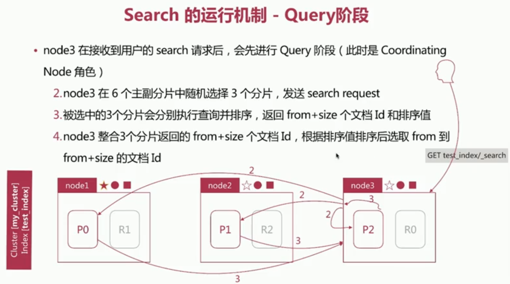
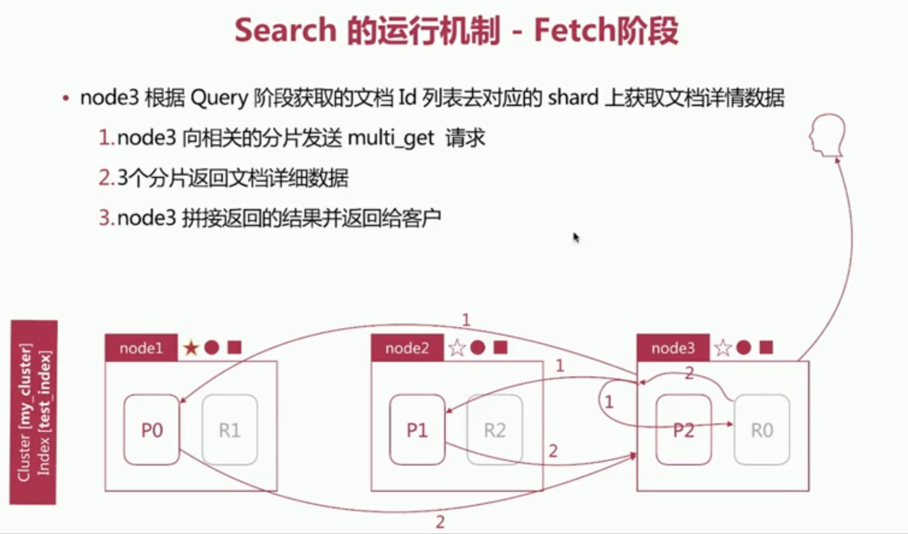
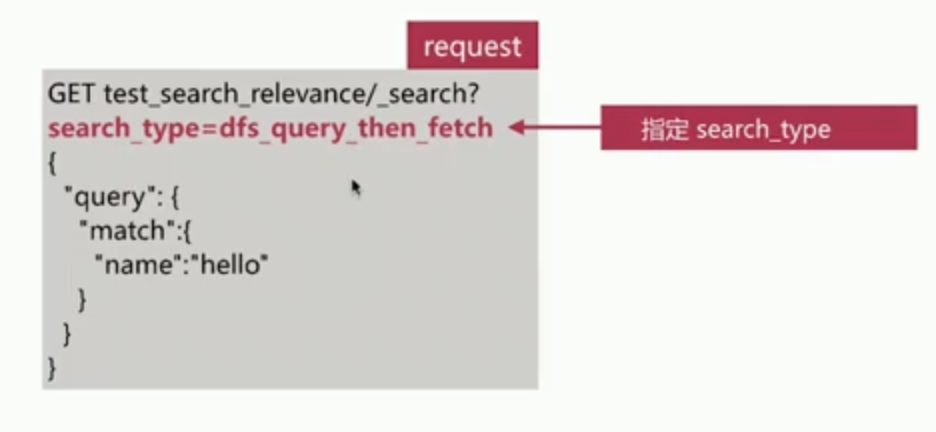
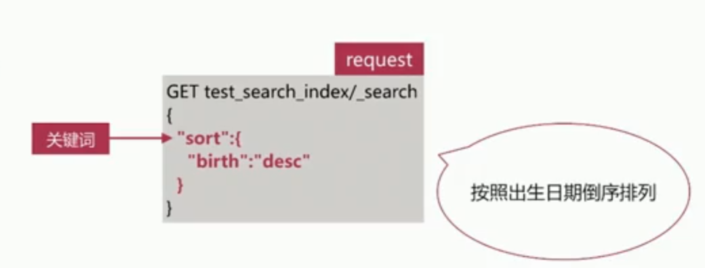

# Search API
> 实现对es中存储的数据进行查询分析，endpoint为_search
```
GET /<index>/_search

POST /<index>/_search

GET /_search

POST /_search
```
> \<index>:索引名称的逗号分隔列表或通配符表达式

## 查询的形式

### [query string as a parameter](https://www.elastic.co/guide/en/elasticsearch/reference/current/search-uri-request.html#search-uri-request)
> 请求URI搜索不支持完整的Elasticsearch Query DSL，但便于测试
```
GET twitter/_search?q=user:kimchy
```

#### 查询参数
```
GET my_index/_search?q=alfred&df=user&sort=age:asc&from=4&size=10&timeout=1s
```
- q  
  指定查询的语句，语法为[Query String Syntax](https://lucene.apache.org/core/2_9_4/queryparsersyntax.html):   
  > `term与phrase`    
  > alfred way 等效于alfred OR way   
  > "alfred way" 词语查询，要求先后顺序  
  > `泛查询`    
  >alfred等效于在所有字段去匹配该term    
  >`指定字段`    
  >name:alfred  
 
- df
  > q中不指定字段时默认查询的字段，如果不指定，es会查询所有的字段
- sort
  > 排序
- timeout
  > 指定超时时间，默认不超时
- from,size
  > 分页参数

### [request body](https://www.elastic.co/guide/en/elasticsearch/reference/current/search-request-body.html)

>可以使用搜索DSL来执行搜索请求，该搜索DSL包括查询DSL
```
GET /twitter/_search
{
    "query" : {
        "term" : { "user" : "kimchy" }
    }
}
```
## [Query DSL](https://www.elastic.co/guide/en/elasticsearch/reference/current/query-dsl.html)
> Elasticsearch提供了基于JSON的完整查询DSL（特定于域的语言）来定义查询。将查询DSL视为查询的AST（抽象语法树），它由两种子句组成：

### Leaf query clauses(叶子查询字句)
> 叶子查询子句在特定字段中查找特定值，例如match，term或range查询。这些查询可以自己使用。

#### 全文匹配
>针对text类型的字段进行全文检索，会对查询语句先进行分词处理，如match、match_phrase等query类型

- [match](https://www.elastic.co/guide/en/elasticsearch/reference/current/query-dsl-match-query.html)
```
GET my-index/_search
{
  "query": {
    "match": {
      "username": "jack tom"
    }
  }
}
```
> operator参数控制单词间的匹配关系，默认是OR
```
GET my-index/_search
{
  "profile": true,
  "query": {
    "match": {
      "username": {
        "query": "tom jack",
        "operator": "and"
      }
    }
  }
}
```
> minimum_should_match参数指定必须匹配子句的最小数量
```
GET my-index/_search
{
  "profile": true,
  "query": {
    "match": {
      "username": {
        "query": "tom jack",
        "minimum_should_match": 2
      }
    }
  }
}
```
- `match_phrase`
> 检索时对词语顺序有要求
```
GET my-index/_search
{
  "query": {
    "match_phrase": {
      "job": {
        "query": "math english"
      }
    }
  }
}
```
> slot参数表示词条相隔多远时仍能将文档视为匹配，即需要移动词条几次可匹配
```
GET my-index/_search
{
  "query": {
    "match_phrase": {
      "job": {
        "query": "english chinese math",
        "slop": 3
      }
    }
  }
}
```
> analyzer参数指定何种分析器来对该短语进行分词处理
```
GET /_search
{
    "query": {
        "match_phrase" : {
            "message" : {
                "query" : "this is a test",
                "analyzer" : "my_analyzer"
            }
        }
    }
}
```

#### 单词匹配
>不会对查询语句作分词处理，直接去匹配字段的倒排索引，如term、terms、range等query类型

- `term`
> 将整个查询语句作为单词进行查询，即不对查询语句进行分词处理
```
GET /_search
{
    "query": {
        "term": {
            "user": "Kimchy"
        }
    }
}
```
> boost参数是浮点数，用于降低或增加查询的相关性分数。默认为1.0
```
GET /_search
{
    "query": {
        "term": {
            "user": {
                "value": "Kimchy",
                "boost": 1.0
            }
        }
    }
}
```
> 注意！！！！由于不对查询语句进行分词处理，会把整个语句去匹配倒排索引  
下面查询不会检索出包含"Quick Brown Foxes!"的文档
```
GET my_index/_search?pretty
{
  "query": {
    "term": {
      "full_text": "Quick Brown Foxes!"
    }
  }
}
```
- `terms`
>和`term`查询相同，不同的是`terms`可以搜索多个值
```
GET /_search
{
    "query" : {
        "terms" : {
            "user" : ["kimchy", "elasticsearch"],
            "boost" : 1.0
        }
    }
}
```
- `range`
> 范围查询主要针对数值型和日期型
```
GET my-index/_search
{
    "query": {
        "range" : {
            "age" : {
                "gte" : 10,
                "lte" : 20,
                "boost" : 2.0
            }
        }
    }
}
```
> 当字段参数为日期字段数据类型时，可以使用
[date math](https://www.elastic.co/guide/en/elasticsearch/reference/7.4/common-options.html#date-math)

```
GET _search
{
    "query": {
        "range" : {
            "timestamp" : {
                "gte" : "now-1d/d",
                "lt" :  "now/d"
            }
        }
    }
}
```

### Compound query clauses(复合查询字句)
> 复合查询子句包装其他叶查询或复合查询，并用于以逻辑方式组合多个查询（例如bool或dis_max查询），或更改其行为（例如constant_score查询）
[☞相关链接](https://www.cnblogs.com/qdhxhz/p/11529107.html)
- `Boolean Query`
> 布尔查询由一个或多个布尔子句组成，每个布尔子句包含以下类型：  
```
POST _search
{
  "query": {
    "bool" : {
      "must" : {
        "term" : { "user" : "kimchy" }
      },
      "filter": {
        "term" : { "tag" : "tech" }
      },
      "must_not" : {
        "range" : {
          "age" : { "gte" : 10, "lte" : 20 }
        }
      },
      "should" : [
        { "term" : { "tag" : "wow" } },
        { "term" : { "tag" : "elasticsearch" } }
      ],
      "minimum_should_match" : 1,
      "boost" : 1.0
    }
  }
}
```
> `filter`:只过滤符合条件的文档，不计算相关性得分  
es针对filte有只能缓存，执行效率很高
```
GET _search
{
  "query": {
    "bool": {
      "filter": {
        "term": {
          "status": "active"
        }
      }
    }
  }
}
```
> `must`:文档必须符合must中的所有条件，会影响相关性得分，等于每一项得分相加  

> `must_not`:文档必须不符合所有条件，计分会被忽略，并会缓存字句

> `should`:可以符合条件，会影响相关性得分

- `constant_score`
> 包装filte查询，并返回相关分数等于boost参数值的每个匹配文档
```
GET /_search
{
    "query": {
        "constant_score" : {
            "filter" : {
                "term" : { "user" : "kimchy"}
            },
            "boost" : 1.2
        }
    }
}
```

## Search的运行机制
> es在查询时可以指定搜索类型为`QUERY_THEN_FETCH`、`QUERY_AND_FEATCH`、`DFS_QUERY_THEN_FEATCH`、`DFS_QUERY_AND_FEATCH`
### query then fetch(默认搜索类型)

#### query阶段

#### fetch阶段


### 相关性算分

#### 问题描述
- 相关性算分在shard与shard之间是相互独立的，意味着同一个term的IDF值在不同的shard是不同的，文档的相关性算分和它所处的shard有关
- 在文档数量不多时，会导致相关性算分严重不准的情况发生

#### 解决思路
- 设置分片数为1，从根本上解决问题，在文档数量不多时可以考虑该方案，适用百万到千万级别的文档数量
- 使用`DFS Query-then-Fetch`查询方式
> 在进行查询之前， 先对所有分片发送请求， 把所有分片中的词频和文档频率等打分依据全部汇总到一块， 再执行query_then_fetch操作


## 排序 
> es默认采用相关性算分排序，可以通过设定sorting参数来自行设定排序规则  
排序是在每个字段级别上定义的，其中特殊字段名供_score按分数排序，而_doc按索引顺序排序。


- 按照字符串排序比较特殊，es有text和keyword两种类型，针对text类型的排序
