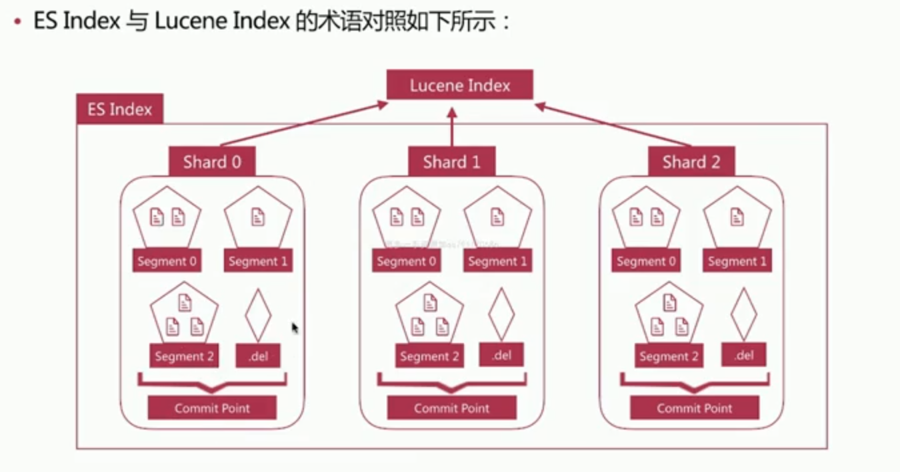
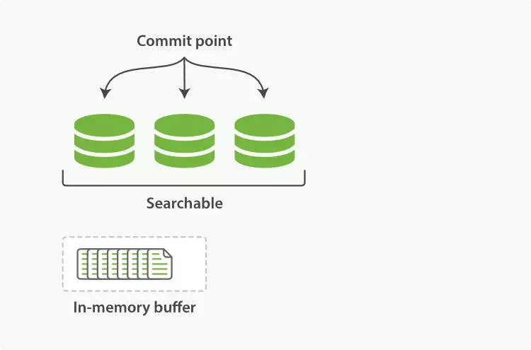
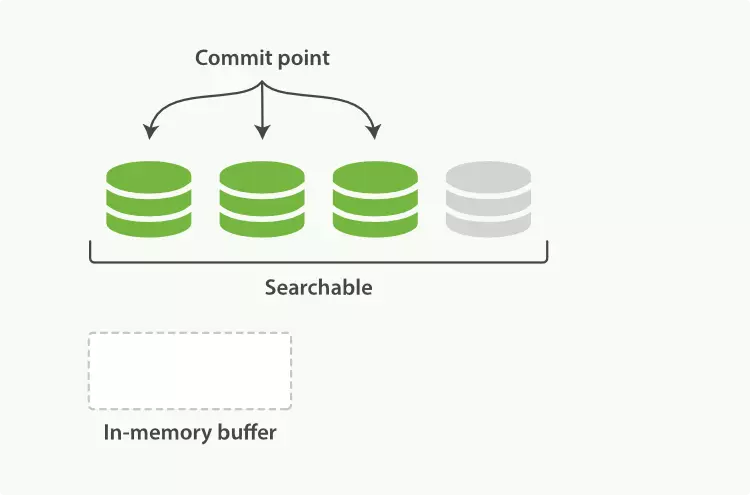
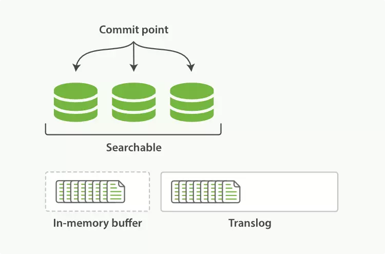

# ElasticSearch集群

> es支持集群模式，是一个分布式系统。  
es集群由多个es示例组成  
不同集群通过集群名字来区分，可通过cluster.name来修改  
每一个es实例本质是一个JVM进程，可通过node.name来修改名字

## Cerebro
> ElasticSearch监控工具
- 下载地址：https://github.com/lmenezes/cerebro/releases

## 构建es集群

```
./bin/elasticsearch -Ecluster.name=my_cluster -Epath.data=my_cluster_node1 -Enode.name=node1 -Ehttp.port=5200 -d

./bin/elasticsearch -Ecluster.name=my_cluster -Epath.data=my_cluster_node2 -Enode.name=node2 -Ehttp.port=5300 -d

/bin/elasticsearch -Ecluster.name=my_cluster -Epath.data=my_cluster_node3 -Enode.name=node3 -Ehttp.port=5400 -d
```

### Cluster State
> Cluster State 存储在每个节点上，master维护最新版本并同步给其他节点
- 集群的节点信息，比如节点名称、连接地址等
- 索引信息，包括索引名称、mapping、setting等
- 集群中所有分片的位置
- 所有集群级别的设置

### [Node](https://www.elastic.co/guide/en/elasticsearch/reference/current/modules-node.html)
> 每当您启动Elasticsearch实例时，您都在启动节点。连接的节点的集合称为群集。  
默认情况下，群集中的每个节点都可以处理HTTP和传输流量。  
所有节点都知道群集中的所有其他节点，并且可以将客户端请求转发到适当的节点。

#### Master Node
> 主节点负责集群范围内的轻量级操作，例如创建或删除索引，跟踪哪些节点是集群的一部分以及确定将哪些分片分配给哪些节点  
Master Node通过集群所有节点选举产生，可以被选举的节点称为master-aligible节点，其配置为`node.master:true`，这个是节点的默认配置

#### Date Node
> 数据节点保存数据并执行与数据相关的操作，例如CRUD，搜索和聚合，配置为`node.data:true`

#### Coordinating Node
> 协调节点，处理请求的节点，负责路由请求到正确的节点，如创建索引的请求需要路由到Master节点  
所有节点默认是Coordinating Node  


### 副本与分片
>索引已经创建，增加节点能否提高索引的数据容量？  
不能，索引创建时分片的分布已经确定，新增的节点无法利用。

>索引已经创建，增加副本数能否提高索引的读取吞吐量？（3个分片3个节点）  
不能，新增的副本也是分布在相同的节点，利用了相同的资源，要增加吞吐量，还需要增加节点。

### 集群状态
> 查看集群状态:`GET _cluster/health`
- green 健康状态，指所有主副分片都正常分配
- yellow 指所有主分片都正常分配，但有副本分片未正常分配
- red 有主分片未分配

### 故障转移
> 1、假设集群由三个节点组成，node1、node2和node3，其中node1是主节点，此时的集群状态是green。  
2、当node1所在机器宕机导致服务终止，node2和node3发现node1无法响应一段时间后会发起master选举，这里选择node2为主节点，此时由于node1的主分片下线，集群状态为red  
3、node2发现node1的主分片未分配，会将副本分片提升为主分片，此时所有的主分片正常分配，集群状态为yellow  
4、node2为node1的分片生成新的副本，集群状态变为green

### es读写流程
#### Lucene Index
- 在 Lucene 中，单个倒排索引⽂件被称为Segment。Segment 是⾃包含的，不可变更的，多个 Segments 汇总在⼀起，称为 Lucene 的 Index，ES中的一个Shard(分片)对应一个Lucene Index，另外使用一个 commit 文件，记录索引内所有的 segment  
- 当有新文档写⼊时，会生成新 Segment，查询时会同时查询所有 Segments，并且对结果汇总。Lucene 中有⼀个⽂件，用来记录所有 Segments 信息，叫做 Commit Point  
- 删除的⽂档信息，保存在“.del”文件中


#### Refresh
- Segment写入磁盘的过程很耗时，可以借助文件系统的缓存特性，先将Segment在缓存中创建并开放查询进一步提升实时性，该过程称为refresh
- 在refresh之前，数据会首先写到index buffer中，此时数据不可被查询

- refresh时会将buffer中所有文档清空并生成Segmeng，此操作不会将数据写入磁盘

- Refresh 频率：默认 1 秒发生⼀次，可通过 `index.refresh_interval` 配置。Refresh 后，数据就可以被搜索到了。这也是为什么 Elasticsearch 被称为近实时搜索

#### Transction log
- 写入文档到buffer时，同时将该操作写入translog

- translog文件会即时写入到磁盘，6.x默认每个请求都会落盘，可以修改为每5秒写入一次，这样的风险是会丢失5秒的数据，相关配置为`index.translog.*`
- es启动会检查translog文件，并从中恢复数据

#### Flush
- 将translog写入磁盘
- 将index buffer清空，其中的文档生成新的segment，相当于refresh操作
- 更新commit point并写入磁盘
- 将内存中的segment写入磁盘
- 删除旧的translog文件

#### Segment Merging
- 随着segment增多，由于一次查询的segment数增多，查询速度会变慢
- es会定时在后台进行segment merge的操作，减少segment的数量
- 通过force_merge api可以手动执行segment merge操作，`post my_index/forcemerge`